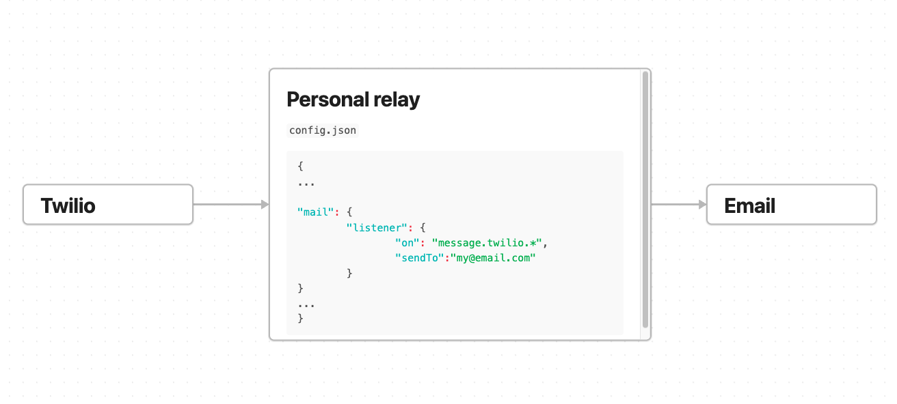

# Personal relay

Connect your communication channels. General purpose customizable relay for bridging communication channels like 
SMS, Email, Signal, Telegram, WhatsApp, etc... Configure your desired integration and start receiving messages and
resending them to other channels. Are you tired of spam callers? Buy twilio number and forward your SMS to Email.




## Integrations
- Twilio
- Email

Feel free to add more integrations 😉


## Setup

## Configuration
Relay is configured using `config.json` file. Here is example configuration file:
```
{
  "port": 3000,
  "host": "localhost",
  "integrations": {
    "twilio": {
      "accountSid": "XXXXXXXXXXXXXXXX"
      "token": "XXXXXXXXXXXXXXXX",
      "listener": {}
    },
    "mail": {
      "host": "smtp.mail-server.com",
      "user": "user@mail-server.com",
      "password": "EMAIL_PASSWORD",
      "listener": {
        "on": "message.*",
        "sendTo": "emial_destination@gmail.com"
      }
    }
  }
}

```


## Development

### Installation

```bash
$ npm install
```

### Running the app

```bash
# development
$ npm run start

# watch mode
$ npm run dev

# production mode
$ npm run start:prod
```

### Test

```bash
# unit tests
$ npm run test

# e2e tests
$ npm run test:e2e

# test coverage
$ npm run test:cov
```


